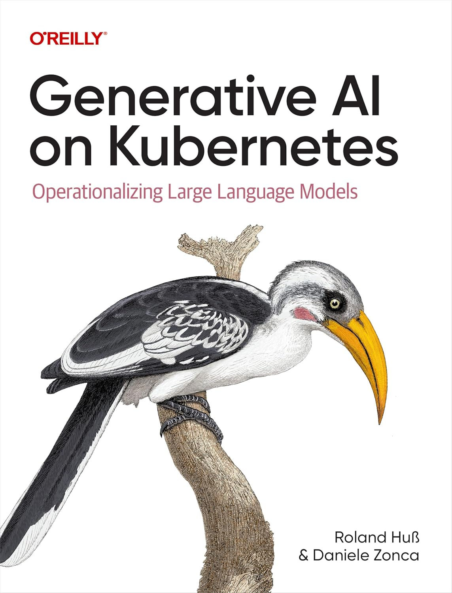

# [Book][Roland Huss, Daniele Zonca] Generative AI on Kubernetes: Operationalizing Large Language Models [ENG, 2026]

**Download Link:**  
https://www.redhat.com/en/resources/oreilly-generative-ai-kubernetes-analyst-material

Generative AI (gen AI) is revolutionizing industries, and Kubernetes has fast become the backbone for deploying and managing these resource-intensive workloads. This O'Reilly e-book serves as a practical guide for MLOps engineers, developers, Kubernetes administrators, and AI professionals looking to combine AI innovation with cloud-native infrastructure.

Authors Roland Huß and Daniele Zonca provide a clear roadmap for training, fine-tuning, deploying, and scaling genAI models on Kubernetes while addressing challenges like resource optimization, automation, and security. Through real-world examples and actionable insights, readers will learn how to manage genAI applications in production and operationalize AI workloads at scale.

 

## Chapters:

**Part I. Inference**

<ol>
  <li>📖 Deploying Models</li>
  <li>📖 Model Data</li>
</ol>

**Part II. Production Readiness**

<ol start="3">
  <li>Kubernetes and GPUs</li>
  <li>Running in Production</li>
  <li>Model Observability</li>
</ol>

**Part III. Tuning**

<ol start="6">
  <li>Model Customization</li>
  <li>Job Scheduling Optimization</li>
</ol>

**Part IV. AI-Driven Apps**

<ol start="8">
  <li>AI-Driven Applications</li>
  <li>Running Agentic Applications in Production</li>
</ol>

  

---

 

<a href="https://aiops.ru/">Предложить инженеру работу / подработку на проекте с kubernetes, microservices, machine learning, big data, golang</a>